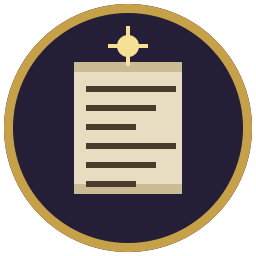

# Хронист — генератор фэнтезийных историй

Настольная программа, которая по одному слову-сиду создаёт связную историю
фэнтезийного мира: от первых племён до государств Эпохи Железа.

Генерация **детерминированная**: один и тот же сид всегда даёт один и тот же
мир — до последней даты и до последнего имени.



---

## Как запустить

Нужен установленный **Python 3.8 или новее** (в Windows и macOS он идёт вместе
с Tkinter — больше ничего ставить не нужно).

| Система | Что сделать |
|---|---|
| **Windows** | Двойной щелчок по `Запустить.bat`. Чтобы появился значок на рабочем столе — один раз запустите `Создать ярлык на рабочем столе.bat`. |
| **macOS** | Двойной щелчок по `Запустить.command` (при первом запуске: правый клик → «Открыть»). |
| **Linux** | `./Запустить.sh`, либо один раз запустите `Создать ярлык (Linux).sh` — появится значок в меню приложений. Может понадобиться `sudo apt install python3-tk`. |

Если Python не установлен, скачайте его с <https://www.python.org/downloads/>
и **обязательно поставьте галочку «Add Python to PATH»**.

### Без окна, из консоли

```
python main.py --cli --seed "Ясень-7" --years 10000 --out летопись.txt
python main.py --cli --seed "Ясень-7" --years 10000 --out мир.json
python main.py --help
```

---

## Что уже умеет генератор

### Блок 1 — основа движка

* **Время.** 10 000 лет по умолчанию, настраивается перед генерацией.
  Год — 12 месяцев по 30 дней, у каждого месяца своё внутримировое имя
  (Хладень, Ледолом, Первоцвет…).
* **Пять эпох:** Сотворения, Богов, Мифов, Героев, Железа. Границы эпох
  слегка «плавают» от сида. Каждая эпоха обрывается большим событием —
  «Уход Творцов», «Война Богов», «Гибель Последнего Дракона», «Битва Тысячи
  Знамён» — и это событие уносит часть стран, городов, племён и лагерей.
* **Сид.** Любое слово или число; кнопка «Случайный» подбирает новый.
* **Расы** (21): люди, дворфы, эльфы (обычные, высшие, тёмные), полулюди
  (кошко-, волко-, медведо-, лисо-, птицелюды), зверолюды (ящеро-, змее-,
  жаболюды, черепахолюды, панцирный народ) и злые расы (орки, гоблины,
  тролли, огры, кобольды, гноллы).
  * цивилизованные народы проходят путь «племя → город → страна»;
  * **зверолюды разумны, но остаются племенами** — ни городов, ни государств;
  * **злые расы не создают стран** — только лагеря, логова, норы и орды.
* **Начало истории.** В первую эпоху в мире есть только племена. Расы
  пробуждаются в разные века, расселяются, дробятся на новые племена, и лишь
  потом оседают и строят первые города.
* **Имена в духе расы.** Эльфийские названия текучие и певучие
  («Сильвэльдор», «Серебряная Роща»), дворфийские — твёрдые и составные
  («Кхаз-Дурум», «Железные Врата»), человеческие — привычные на слух
  («Вестгард», «Тихий Рубеж»), орочьи — рычащие («Гхарак», «Драные Колья»).
* **База данных мира.** Всё, что происходит, записывается: кто основал
  страну или город, какой расы был основатель, когда родился и когда умер,
  из какого племени вышел, в какой земле это случилось. Любую сущность можно
  открыть двойным щелчком и увидеть её карточку со списком событий.
* **Сохранение.** Мир целиком кладётся в один файл `.json` и открывается
  заново; летопись выгружается в `.txt`.

### Блок 2 — династии, знатные рода и борьба за власть

* **Знатные рода.** Тот, кто основал город или страну, кладёт начало роду:
  его потомки носят общее родовое имя. **У простолюдинов фамилии нет** —
  она и есть знак знатности. Роды бывают правящие, великие и малые,
  заводят младшие ветви, теряют родовые гнёзда и пресекаются.
* **Родовые имена в духе расы.** У людей — `Дом Альдеринг`, `Род Марбранд`;
  у дворфов — `Клан Железнобород`, `Клан Камнерез`; у эльфов — `Дом Аэлиндор`,
  `Сень Лорселас`; у волколюдов — `Стая Морозолап`; у лисолюдов —
  `Дом Девятихвост`; у птицелюдов — `Гнездо Острокрыл`.
* **Законы наследования — по расам:**

  | Народ | Порядок престолонаследия |
  |---|---|
  | Люди | старший сын, при отсутствии сыновей — дочери |
  | Дворфы, медведолюды | старший в роду (брат раньше сына) |
  | Высшие эльфы, птицелюды | старший из детей, сын или дочь — всё равно |
  | Тёмные эльфы | по женской линии: старшая дочь, сестра, племянница |
  | Эльфы | совет дома выбирает достойнейшего |
  | Кошколюды, лисолюды, все вольные союзы | знать выбирает правителя из глав домов |
  | Волколюды | власть берёт сильнейший |

* **Родословные.** У правителей и глав родов есть супруги и дети, у детей —
  свои дети. Знать называет детей в честь предков, отсюда порядковые номера:
  `Ронвальд III Альдеринг`, `королева-под-горой Фара IV Дурабур`.
  Часть детей не доживает до совершеннолетия — и это меняет ход истории.
* **Регентства.** Малолетний наследник всходит на престол при регенте (мать,
  дядя или глава рода) и берёт власть сам по достижении совершеннолетия —
  а совершеннолетие у дворфа наступает в 40, у высшего эльфа в 110.
* **Дворцовые перевороты и узурпации.** Брат травит брата, чужой дом поднимает
  мятеж, совет знати низлагает правителя, а у волколюдов власть отбирают
  в поединке. Заговор может и провалиться — тогда голову теряет заговорщик,
  а его род — земли и честь. Свергнутого убивают, изгоняют или запирают
  в башне; иногда он возвращается на престол.
* **Смены династий и пресечение родов.** Если наследников не осталось, корона
  переходит другому дому, а иногда — человеку без рода и имени, который
  заводит новую династию. Бывает и междуцарствие.
* **Устойчивость по расам.** Дворфийский клан держит престол тысячу лет,
  человеческая династия — двести, а у тёмных эльфов и волколюдов правление
  обрывается ножом чаще, чем старостью. Долгоживущие народы не наказаны
  за долголетие: опасность считается на поколение, а не на год.

Всё это попадает в базу мира: каждое правление записано (кто, когда, чем
кончилось), у каждой личности видны отец, мать, супруг, дети, род и список
правлений.

### Блок 3 — бедствия, вторжения и наследие катастроф

* **Тридцать видов бедствий** пяти семейств: природные (засухи, наводнения,
  пожары, моры, землетрясения, извержения, саранча, падёж, годы бурь),
  долгие перемены климата (ледники, потепления, вулканические зимы,
  наступление моря), вторжения (демоны, драконы, нежить, глубоководные,
  адские рои, Пустота, чудовища), политические (распад держав, феодальная
  раздробленность, нашествия племён, войны за наследство, восстания)
  и магические (бури, разломы, проклятия, войны чародеев).
* **Пять степеней тяжести** — от местной беды до апокалипсиса. Природа
  редко доходит до высших ступеней: конец света устраивают вторжения,
  разломы и вулканическая зима.
* **У каждого мира свой нрав.** По сиду определяется, к каким бедам мир
  склонен: один изводят драконы и мор, другой — ледники и войны чародеев,
  а демонов он не увидит ни разу. Это главное, из-за чего пять миров
  читаются как пять разных миров.
* **Беды накладываются друг на друга.** Если засуха совпала с вторжением,
  обе усиливаются, начинается голод, и счёт потерь идёт вдвое быстрее.
* **Численность и потери.** У стран и поселений есть население в людях
  (город плюс кормящая округа). Летопись пишет, сколько врагов пришло,
  сколько лет они бесчинствовали, сколько погибло в каждой стране
  и у каждого народа. По эпохам видно, как мир рос: три тысячи душ
  в Эпоху Сотворения, семь миллионов в Эпоху Железа.
* **Разные пути спасения.** Владыку демонов может убить один герой или
  отряд героев, его войско — разбить всемирная коалиция под началом
  живых королей, его самого — запечатать ценой жизни чародеев; дракона
  можно откупить данью, рой — переждать, а можно и не спастись:
  беда выжжет всё и схлынет сама.
* **Сражения с именами.** У больших вторжений бывают битвы, и в них гибнут
  настоящие правители — после чего в их странах начинается наследование
  со всеми последствиями из блока 2.
* **Тёмные века.** После тяжёлой беды мир надолго перестаёт расти:
  от полувека до тысячи с лишним лет, в зависимости от того, сколько
  бедствие длилось и скольких унесло.
* **Следы бедствий и связность истории.** Беда оставляет по себе печати,
  логова, кладки яиц, гробницы, недобитых военачальников, проклятые
  места и прорехи в ткани мира. Через века и тысячелетия такой след
  тревожат — и он даёт начало новой, уже небольшой беде, прямо
  ссылающейся на исходную: «в далёких горах будят древнего дракона,
  уцелевшего от Выводка Багряного Крыла, что жёг мир две тысячи лет назад».
* **Все ключевые лица попадают в базу:** вождь вторжения и его
  военачальники, герои-победители, полководцы коалиции, павшие в битвах.
  У каждого своя карточка со связями.

### Блок 4 — боги, веры и храмы

* **Вера рождается не сразу.** Первые века мир обходится без имён богов:
  по сиду определяется год, когда кто-то впервые услышит откровение —
  обычно это вторая-третья тысяча лет. У каждой веры есть пророк,
  и он попадает в летопись.
* **62 сферы покровительства** с готовыми падежными формами: солнце, луна,
  звёзды, ветер, буря, море, огонь, лёд, камень, урожай, очаг, семья,
  исцеление, ремесло, кузня, торговля, дороги, лес, звери, охота, война,
  честь, клятвы, закон, мудрость, память, тайны, волшебство, судьба, сны,
  песнь, удача, пиры, воровство, воля, смерть, загробье, зима, мор, кровь,
  яд, пауки, страх, безумие, пустота, тирания, разрушение, алчность,
  месть, жертва и другие. Бог берёт одну-четыре сферы, и они определяют
  его титул, знак и праздник: `Аэлинтар, Владыка Леса`, знак — серебряный
  лист, праздник — Ночь Ветвей.
* **Мировоззрение от +3 до −3:** всеблагое, светлое, строгое, непостижимое,
  двуликое, тёмное, злое. Вера с мировоззрением −2 и ниже объявляется
  запретной — отсюда гонения и походы.
* **Праздник у каждого бога** — свой день в году (месяц и число), и раз
  в несколько поколений летопись отмечает, как его справляли.
* **Расы верующих и история веры.** Молодая вера держится своего народа,
  древняя расходится по всему свету: чем старше религия, тем легче её
  принимают чужаки. Светлые народы неохотно идут в тёмные культы,
  и наоборот. У каждой веры записано, кто в неё верит, сколько верующих
  сейчас и сколько было в лучшие годы.
* **Государственная вера.** Когда больше половины городов страны молятся
  одинаково, корона объявляет веру государственной, а правитель обращается
  первым. Если это оказывается тёмный культ — соседи закрывают границы.
* **Храмы и святилища** строят жрецы-основатели; великие храмы возводят
  в столицах. Погибший город или забытая вера оставляют после себя
  пустой храм.
* **Расколы и ереси.** Старая большая вера раскалывается: ересиарх уводит
  часть городов, иногда с другим мировоззрением. Треть расколов
  заканчивается войной за веру.
* **Гонения, походы и войны за веру.** Запретную веру выжигают внутри
  страны, а если её приверженцы за границей — объявляют священный поход.
  Оба случая — полноценные бедствия из блока 3, со сражениями, потерями
  и героями.
* **Боги даруют и проклинают.** За построенный храм, исполненную клятву,
  отказ отречься под пыткой бог даёт долголетие, вещие сны, исцеляющие
  руки или голос, которому верят, — и жизнь отмеченного действительно
  удлиняется. За осквернение храма, нарушенную клятву или пролитую родную
  кровь приходит проклятие: бесплодие рода, немота, гниль, проклятие
  на семь колен — и смерть приходит раньше срока, а род теряет влияние.
  Каждый такой человек попадает в базу с пометкой, именем бога и прозвищем.
* **Избранники богов.** Победитель большого бедствия нередко оказывается
  тем, кому бог дал знак перед последней битвой.
* **Гнев богов как объяснение.** Большую беду жрецы приписывают тёмному
  божеству — и приверженцев его веры бьют на улицах.
* **Забвение и возвращение.** Вера, потерявшая всех верующих, забывается;
  её храмы остаются в мире следами. Через века эти руины находят —
  и вера может подняться заново, спустя тысячу лет после последнего жреца.
* **У каждого мира свой религиозный нрав:** устройство (многобожие,
  родовые культы, единобожие), набожность и склонность богов к тьме.
  В одном мире девятнадцать живых вер и триста богов, в другом — тридцать
  четыре бога на весь свет.

### Блок 5 — карты мира из TECTONIC WORLDFORGE

Генератор умеет строить историю не на выдуманной сетке земель, а на
**настоящей гексовой карте** — файле `.world`, который выдаёт картогенератор
TECTONIC WORLDFORGE. Выберите карту перед генерацией (кнопка
«Выбрать .world…») — и мир начнёт опираться на её данные.

* **Земли** режутся из карты: гексы собираются в два-три десятка областей
  вдоль границ биомов, так что хребет не делится пополам, а степь не
  растворяется в лесу. Местность, высота, температура, влажность, плодородие,
  руды и ёмкость земли — всё считается по карте.
* **Имена земель** карта даёт свои: хребты, острова и заливы попадают в
  летопись под своими именами, переложенными на кириллицу. Где именованного
  объекта рядом нет, имя придумывает кузница имён.
* **Города** садятся не «в землю вообще», а в конкретный гекс — на плодородное
  место, по возможности у реки или на берегу. **Лагеря злых народов** —
  наоборот, в глушь, где дичее и безлюднее.
* **Природные бедствия** берутся из маски местных угроз: где вулкан — там
  извержения, где сухо — засухи, где берег — цунами. Чего на карте нет, того
  в мире почти не случается.
* **Долгие перемены климата** вшиты в сид карты: ледниковый период,
  вулканическая зима, великая засуха, плювиал начнутся ровно в тот год и
  продлятся ровно столько, сколько назначила карта. Ледник ползёт от полюсов,
  засуха выжигает и без того сухое — по-настоящему всемирными становятся
  только самые тяжёлые.
* **Логова существ** с карты ложатся в мир спящими следами ещё до первых
  племён. Через века их будят — и дракон, левиафан или титан выходит наружу
  тем бедствием, которое карта ему и назначила.
* **Поле магии** решает, где приживутся тёмные культы: народ, осевший в
  землях с дурной славой, скорее уверует в кого-то тёмного.
* **Раса, которой на карте негде жить, в мир не приходит вовсе.** Мир без
  гор остаётся без дворфов, мир без болот — без ящеролюдов. Кого не хватило,
  сказано на вкладке «Земли».

**Обратный мост.** После генерации «Файл → Сохранить политическую карту
(`chronicle.json`)» пишет историю обратно в формате, который читает вкладка
«Страны» картогенератора: кадр границ раз в полвека плюс ключевые кадры на
границах эпох, города с годами основания и гибели, столицы, цвета держав по
народам. Загрузите файл туда — и десять тысяч лет истории проиграются по
годам прямо на вашей карте: державы возникают, растут, делятся и гаснут.

Из консоли:

```
python main.py --cli --seed "Ясень-7" --map maps/aurora-7.world \
    --chronicle chronicle.json --out летопись.txt
```

Готовая карта для пробы лежит в `maps/`; там же описано, как сделать свою.

### Блок 6 — народы держав, походы и те, кто остался в памяти

**Страна больше не одного народа.** Империя людей берёт горы дворфов —
и в ней уже два народа, возьмёт лес эльфов — будет три. Что дальше,
зависит от того, какова эта империя:

* **закон о народах** — от равных прав до искоренения, через подданство,
  поражение в правах и рабство. Выбор зависит от нрава народа (у
  работорговцев и налётчиков он свой), от веры державы (тёмная развязывает
  руки, светлая связывает) и от самого правителя: новый государь в первые
  годы правления может переписать закон в любую сторону;
* **обида копится** у тех, кого притесняют, и тем быстрее, чем их больше;
* **ответ бывает разный:** мятеж давят; меньшинство уносит свои города и
  объявляет их вольными; или — если народа уже много — оно садится на
  престол, и держава остаётся, а титульный народ в ней меняется;
* **мирный путь тоже есть:** при равных правах малый народ врастает
  в титульный за несколько поколений, а если большинство давно не
  титульное, престол переходит к нему без единой капли крови;
* **резня и работорговля** оставляют след в летописи и в числах: население
  меньшинства убывает, обида растёт вдвое.

**Походы в неизведанное.** Пока земли связаны сушей, молва расходится сама.
За водой — нет: остров, архипелаг, дальний материк остаются пустыми
пятнами, пока кто-нибудь не рискнёт туда доплыть.

* держава с гаванью снаряжает корабли; у мореходов это выходит чаще, из
  подгорного чертога в море не выйти вовсе;
* **большинство походов кончается ничем** — пустым горизонтом, берегом,
  который видели издали, или молчанием, когда не возвращается никто;
* **каждая попытка что-то оставляет:** следующий поход к той же цели идёт
  увереннее, и третий находит то, на чём сгинули два первых;
* **открытая земля становится ведомой** — туда можно селиться, и там
  вырастает колония, которая через века перестанет слушаться метрополии
  и станет отдельной страной;
* отдельный подвиг — **дойти до края света**, до льда, за которым ничего
  нет. Это удаётся двум-трём за всю историю мира, и их имена остаются.

**Народы внутри рас.** Раса — это не народ. Раса просыпается не в одной
точке, а несколькими очагами в лучших для неё землях, разнесённых по
карте, и каждый очаг — **отдельный народ**: своё имя, свои промыслы, своя
история. Люди болот у большой реки и люди предгорий за тысячу вёрст —
родня, но общего государства у них может не быть никогда.

Имена народов нарочно **не** собирает та же кузница, что имена людей и
городов: иначе они сливаются в похожие наборы слогов. Здесь три уклада,
и все опираются либо на настоящие слова, либо на имена, которые карта уже
дала земле:

* **от земли** — «валдестадцы», «бринелунцы», «валониты»: имя места плюс
  русский суффикс;
* **по примете** — «Люди Длинных Вёсел», «Дети Позднего Снега», «Сыны
  Слепого Камня»: обычные слова, ни одного выдуманного слога;
* **у ориентира** — «люди океана Коранен», «дети реки Бринелун».

Занятой считается не только само имя, но и его сердцевина, поэтому рядом
не окажутся «Дети Позднего Снега» и «Народ Позднего Снега».

**Имена с карты идут в летопись.** Океаны, моря, материки, острова,
архипелаги, хребты и реки зовутся так, как назвал их картогенератор, и
каждая земля знает свой материк, свою большую воду, свой хребет и свои
реки. Оборот всегда безопасен по падежам: «у океана Коранен», «на
материке Вирен», «хребет Валдестад».

**Те, кто остался в памяти не престолом:** звездочёты, летописцы, лекари,
зодчие, законники, рудознатцы, чародеи, сказители, картографы,
полководцы. Народ тянется к своему ремеслу — дворфы к руде и камню,
эльфы к звёздам и песням, — но не только к нему.

Чтобы такие имена не повторялись, деяние не выбирается из списка, а
собирается: ремесло даёт предмет труда, предмет — действие, действие —
последствие. **Каждый предмет разыгрывается в мире один раз:** если
звёздный атлас уже составлен, второй такой же не появится. Когда у
ремесла кончаются несделанные работы, оно перестаёт рождать имена.

## Окно программы

* **Настройки** — сид, длительность, число земель на карте, плотность событий
  и **карта мира**: файл `.world` либо «нет — земли придумает движок».
* **Летопись** — текст по эпохам, с фильтрами по подробности, расе и поиском.
* **Эпохи, Страны, Города, Племена и лагеря, Знатные рода, Веры, Пантеон,
  Бедствия, Правители, Личности, Народы, Державы и народы, Хозяйство,
  Походы, Земли, Итоги** — таблицы и справки. Заголовки таблиц
  сортируют, двойной щелчок открывает карточку сущности со всеми
  подробностями и её событиями.
* Вкладка **«Правители»** — родословная власти: по каждой стране список всех
  правлений с годами, родом и тем, чем правление кончилось.
* На вкладке **«Личности»** по умолчанию показаны только те, кто попал
  в летопись: за десять тысяч лет в базе набирается больше двадцати тысяч
  имён, включая детей знатных родов.
* Вкладка **«Бедствия»** — все беды мира с уровнем, сроками, числом врагов
  и потерь; в карточке бедствия видны его сражения, следы, победители
  и потери по странам и народам.
* Вкладки **«Веры»** и **«Пантеон»** — все религии мира с числом верующих
  и народами-носителями, а также поимённый список богов со сферами,
  знаками, праздниками и мировоззрением.
* Вкладка **«Народы»** — состав каждой державы по народам с долями, её
  закон о чужих народах, копящиеся обиды и счёт завоеваний.
* Вкладка **«Хозяйство»** — чем каждая держава богата, чего ей не хватает,
  насколько она сыта и какие торговые пути действуют прямо сейчас.
* Вкладка **«Походы»** — все экспедиции с их целями, числом попыток,
  потерями и исходом, плюс те, кто дошёл до края света.
* Вкладка **«Земли»** для мира по карте показывает по каждой области её
  высоту, температуру, влажность, пригодность для жизни, руды, дикость,
  магию, а также чем земля грозит и чем одаривает.

### Блок 7 — хозяйство, дороги и торговля

**Что земля даёт.** У каждой области считается достаток по тринадцати
товарам: хлеб, скот, рыба, лес, камень, металл, соль, шерсть, меха, вино,
пряности, самоцветы и чародейные снадобья. Считается по местности,
плодородию, рудности, рекам, берегу и полю магии с карты, плюс промысел
народа: у рыбаков больше рыбы, у рудознатцев — металла.

**Чего ей не хватает.** Держава сравнивает достаток с нуждой своего
населения. Дворфы сидят на руде, но хлеб у них не растёт; люди пашут
равнину, а металл взять негде. Отсюда и начинается торговля — не от
доброй воли, а от нужды.

* **нехватка** — повод искать, у кого купить; сосед с избытком того же
  товара становится партнёром, если до него можно дойти;
* **договор** кормит обе стороны: у покупателя гаснет нужда;
* **голод** приходит, когда еды нет и купить её не у кого. Держава,
  которой вечно нечем кормить, не голодает каждое десятилетие — она
  просто **не вырастает большой**, и это честнее постоянного мора;
* пути **глохнут** от войны, разорения или потому, что возить стало нечего.

**Дороги — настоящие.** Прежде путь между городами был прямой линией, а
прямая через хребет — это не дорога, а линия на бумаге. Теперь у каждого
гекса своя цена шага, и путь ищется Дейкстрой:

* равнина и степь — дёшево, лес и холмы — вдвое дороже, болото и
  джунгли — вчетверо, горы — очень дорого;
* **высокие пики непроходимы вовсе**: дорога их обходит или идёт
  перевалом — самым низким местом хребта;
* **вдоль реки дешевле**, а **переправа стоит отдельно**: брод и мост
  есть не везде;
* не вышло посуху — идут **морем**, если у обеих держав есть порт.

Проверено: путь через материк выходит длиннее прямой всего на 10 %,
не задевает ни одного пика и на седьмую часть идёт вдоль рек.

**Места под города.** Город встаёт не там, где плодороднее, а там, где
**сходятся пути**: слияние рек, устье, брод, выход из перевала к равнине.
На таких местах города стоят тысячелетиями. После этой правки на реках
стоит четверть городов вместо одного процента, а удобство их мест вдвое
выше среднего по суше.

**Округа города** меряется не в гексах по прямой, а в цене пути: за
хребтом обрывается, вдоль реки тянется далеко. Поэтому держава на карте
получает настоящие очертания, а не круг.

**Города больше не зарастают по всей карте.** Занятость клеток считается
по живым поселениям, а не по всем, что когда-то были: сгинувший город
освобождает свою землю. Раньше за десять тысяч лет вся суша числилась
занятой призраками, и новым городам было негде вставать — они садились
куда попало, мимо рек и удобных мест.

**Всё это уходит в `chronicle.json`:** торговые пути и дороги ложатся в
секции `routes` и `roads`, которые ваша вкладка «Маршруты» уже умеет
рисовать. Пути идут по гексам, без разрывов и без хождения по воде — это
проверяется и самопроверкой, и подлинным кодом оверлея.

### Блок 8 — мироздание, правители-личности и знать как сила

**У мира есть начало — или нет.** При рождении мира бросается жребий о
том, откуда он взялся, и этот ответ вписывается в лор навсегда:

* **единый творец** — один бог сделал мир и остался при нём;
* **круг творцов** — трое-шестеро делили работу и с тех пор спорят;
* **убитый творец** — мир выстроен из тела первого бога;
* **спящий творец** — мир снится тому, кто не просыпался ни разу;
* **без творца** — мир был всегда, а боги пришли позже;
* **случай** — мир вышел побочно, и никто этим не гордится.

Творцы — божества с пометкой «первородный»: у них свои титулы (Отец
Всего, Зодчая, Ткач), своя дата явления (первый день первого года) и своя
судьба — иные правят, иные ушли, иные мертвы. Миф о начале виден в
разделе «Пантеон».

**Боги-покровители.** Божество может опекать не сферу вообще, а
кого-то определённого: народ («покровительница эльфов»), ремесло
(«покровитель каменотёсов»), сословие («покровительница узников») или
место («покровитель перекрёстков»). Все пулы написаны сразу в
родительном падеже — склонять их на ходу генератор не станет.

**Король — человек, а не переменная.** У каждого, кто садится на престол,
теперь есть:

* **нрав** — от «праведный» до «бесчеловечный», плюс две-три черты
  («щедрый», «глухой к советам», «собирательница древностей»); все
  прилагательные хранятся парами, мужской и женский род;
* **четыре умения** 0–10: война, правление, двор, вера. Сумма ограничена,
  так что всесторонне одарённые редки;
* **династическая строка**: когда родился, на ком и в каком году женился,
  чей он сын, когда принял венец, сколько детей, когда и от чего умер;
* **посмертное прозвище** от потомков: Грозный, Строительница,
  Несчастливый. Современники государя так не звали — в прежних записях
  летописи он ещё просто король такой-то.

За малолетнего государя нрава не спрашивают: каков он, узнают, когда он
вырастет. Наследник престола и регент носят свои титулы.

Умения работают, а не лежат: **хозяйская хватка** кормит города (ёмкость
поселений ±22 %), **воинское умение** решает, на кого держава замахнётся,
**искусство двора** гасит заговоры (а слабый двор их растит),
**благочестие** строит храмы и начинает гонения. Нрав тоже работает:
жестокий государь пишет указы жёстче и растравляет обиду покорённых
народов, добрый — смягчает и залечивает.

**Приговор истории.** В конце правления считается не нрав, а то, что
осталось: люди, города, земли — **на фоне остального мира**, чтобы
расцвет века не ставили в заслугу одному государю, а мор — в вину.
Долгое правление судят строже. Отсюда берутся оба знакомых случая:

> Жестокость обернулась силой: страну боялись и потому не трогали.

> Любили — и не слушались: знать растащила страну по вотчинам.

**Лестница знати.** Чем старше и крупнее держава, тем больше в ней
ступеней: молодое княжество знает две, тысячелетняя империя — шесть, от
баронета до герцога. Ступени свои у каждого народа: у дворфов старшины,
мастера и таны, у волколюдов вожаки и ярлы, у тёмных эльфов надзиратели
и матроны. Наверху лестницы стоит правящий дом.

**Дома не одинаковы.** У каждого свой нрав (от «безупречного» до
«гнилого»), достаток, честолюбие и девиз над воротами. Младшая ветвь
наследует нрав ствола, но не повторяет его.

**Знать растёт вместе с державой.** Город без своего рода корона отдаёт
в лен, и знатных фамилий становится больше. Покорённому городу дают знать
из его же народа — так в многонародной империи в общем совете сидят
чужие имена.

**Знать в политике.** Богатый, честолюбивый и чуждый государю по нраву
род копит недовольство — а государь, умеющий держать двор, его гасит.
Накопив довольно, знать переходит к делу:

* **фронда** — требование вольностей: права суда, своей монеты, места в
  совете. Корона уступает (и держава становится чуть менее державой) или
  отказывает (и обиду записывают);
* **междоусобица** — война за венец. Корона ломает мятежный род, понижая
  его в достоинстве, или проигрывает, и на престоле оказывается тот, кто
  начинал мятежником;
* **отложение вотчины** — род уводит родовое гнездо и соседние города в
  отдельную державу;
* **переворот** — к венцу тянется не самый славный род, а самый
  честолюбивый и самый обиженный.

Всё это видно во вкладках «Правители» (родословная с нравом, умениями и
приговором каждому правлению) и «Знать» (справочник родов с титулом,
достатком, девизом и числом вырванных у короны вольностей).

### Блок 9 — войны держав

Прежде завоевание было одним броском: сильный забирал города, и на этом
всё кончалось. Теперь у войны есть причина, длина, сражения, осады, люди
и мир с названием.

**Повод.** Двадцать восемь причин, и все растут из состояния мира, а не
из пустоты:

* **земля** — спор о меже, возврат утраченного, горный проход;
* **хозяйство** — чужая гавань у державы без порта, рудники у державы без
  железа, житницы у голодающей, соляные варницы, пошлины на чужих дорогах,
  просто чужое богатство;
* **вера** — иная вера у соседа, окрепшая ересь, святыня в чужих руках,
  прямая воля бога;
* **народы** — единокровцы под чужой рукой, притеснение, работорговля;
* **престол** — притязание по родству, пустой престол соседа, обида при
  дворе, пролитая кровь посла;
* **чудеса** — пророчество, реликвия древнего бедствия на чужой земле,
  жила магии, проклятие, поднятые мёртвые, драконий клад, вражда со времён
  общей беды.

Повод виден в летописи и в справочнике, и он же решает, насколько яростно
воюют: за веру и за кровь дерутся вдвое дольше, чем за пошлины.

**Войско.** Считается от числа душ: держава выставляет около сотой части
населения. На это влияет всё: воинственность народа (берсерки выводят
вдвое против хлебопашцев), эпоха, голод, закон о народах и **воинское
умение государя** — полководец на престоле приводит больше, чем книжник.
Выучка войска решает не меньше числа.

**Ход.** Год войны — это манёвры, сражение или осада. Чем крупнее война,
тем чаще сходятся. Города берут не силой, а временем: осада тянется
годами, гарнизон за стенами стоит нескольких в поле, и кончается всё либо
открытыми изнутри воротами, либо мором в осадном лагере.

**Случай.** Вдвое сильнейшее войско проигрывает примерно каждое пятое
сражение. Туман, брод, упрямый гарнизон и предавший проводник весят
столько же, сколько лишняя тысяча копий, — без этого история становится
таблицей умножения.

**Люди.** Войско ведёт знатный воевода или сам государь — если умеет
воевать и если ему это по нраву. Государи гибнут в битвах и попадают в
плен, и выкуп за них обсуждают годами. А в решающем сражении может
подняться безвестный сотник: за это ему дают землю и право на родовое
имя — так рождаются новые знатные дома.

**Итог.** Победа нападавших, победа оборонявшихся, ничего, обоюдное
истощение — или война, оборванная тем, чего не было в расчётах: смертью
государя, голодом в тылу, мировым бедствием, тёмными веками. Победитель
берёт то, за чем шёл: города, дань, веру, покорность, добычу, святыню.

**Мир** называют по месту, где его подписали: «Мир в городе Роэнберг»,
«Договор на рубеже земли по имени Долгая Пуща», «Вечный мир в городе
Медные Врата». Если побеждённой державы больше нет — мира не заключают:
не с кем.

**Вековые распри.** Три войны между одной и той же парой держав — и
летописцы перестают считать их по отдельности: у вражды появляется имя,
от «Затяжной» до «Двухвековой». Распря кончается гибелью одной из держав
или тем, что о ней перестают вспоминать.

Всё это видно во вкладке «Войны»: вековые распри, затем каждая война с
поводом, целью, числом сражений, взятыми городами и названием мира.

### Блок 10 — политика, море, рода войск, крепости и наёмники

**Отношение держав** — одно число от −1 до +1, но складывается оно из
того, что в мире уже есть, и каждое слагаемое можно назвать вслух:
родство народов, общая вера, давняя торговля, общий враг, родство
правящих домов, общие союзники, пролитая кровь, дань чужой короне,
общая межа, схожий или несхожий нрав государей, чужие законы о народах.
Поэтому в летописи и написано, *почему* два дома сошлись.

**Расовая склонность.** Дворф с человеком сговорится скорее, чем с
эльфом: между горой и лесом старые счёты (−0,42). Высшие эльфы смотрят
на тёмных как на позор рода (−0,80), зверолюды держатся своих, а со
злыми расами не договаривается никто. Это не запрет, а вес на чаше:
союз дворфов с эльфами возможен — просто его должно что-то перевесить.

**Договоры идут лесенкой:** ненападение → торговый → брачный союз домов
→ союзный договор. Через ступень не прыгают, а рвут в обратном порядке.
Брачный договор — не бумага, а настоящая свадьба наследников двух
правящих домов: это и есть союз аристократии разных стран, и родство
живёт дольше договора, а потом само становится поводом к войне за
наследство.

**Союзы держав.** Три державы, связанные союзными договорами, сводят их
в один союз с именем и целью: «Круг Трёх Держав», «Ковенант Семи
Знамён», «Торговый союз земель по имени Синь». Союз бывает
оборонительным, наступательным, священным или торговым — и распадается
от общей беды, от нового государя, не пожелавшего чужих клятв, от того,
что двое союзников сами сошлись в войне, или просто оттого, что
съезжаться на советы перестали.

**Коалиции на войне.** Союзников зовут — и оборонительный зов исполняют
почти всегда, а наступательный как придётся: чужая война редко бывает
своей. Пришедший приводит около половины войска. Не пришедший ломает
клятву, теряет договор и остаётся с репутацией, которую помнят дольше
самой войны. Новый государь пересматривает клятвы прежнего.

**Море.** Флот растёт не из населения вообще, а из портов: держава в
глубине материка не построит и лодки. Мореходные народы выводят вдвое
против сухопутных. Флот делает соседом любого, у кого есть гавань на том
же море, — так появляются войны без общей границы.

* **морские сражения**, где случай весит ещё больше, чем на суше:
  ветер, течение и внезапный шквал переворачивают бой чаще, чем туман —
  сухопутный. Буря может не дать сойтись вовсе и утопить больше, чем
  сделало бы сражение;
* **блокада гавани**: торговля встаёт, город беднеет, цены растут втрое;
* **высадка за морем**: войско сходит на чужой берег и сразу принимает
  бой — отступать ему некуда;
* новые поводы: **морские пути и проливы**, **морской разбой**,
  **заморские земли**.

**Рода войск.** Войско не однородно: у каждого народа свой состав из
восьми родов — пехота, тяжёлая пехота, лучники, конница, застрельщики,
осадные машины, чародеи и боевые звери. Состав складывается из промыслов
народа и земель, в которых он живёт. Местность решает не меньше числа:
конница в степи стоит полутора себя, в болоте — двух третей; дворфийский
строй в теснине непобедим; под стенами решают машины, а не всадники.
Поэтому дворф, встретивший степняка в горах, бьёт его при любом раскладе
сил — и в летописи написано, почему.

**Крепости** строят не там, где красиво, а там, где узко: на перевале, у
брода, на меже. Города гибнут и зарастают, а крепость стоит веками —
меняется только знамя над ней. В справочнике у каждой видна вся цепочка
хозяев: «700: Кенмарк; 1280: никто; 1970: Стормарк». Крепость даёт
оборонительный перевес в своей земле, её берут долгой осадой, и только в
войне на искоренение её срывают до основания.

**Вольные роты** рождаются из войны: после мира остаются те, кто ничего
другого не умеет. Их нанимают — и тогда они прибавляют войску силы, а
тот, кому приходится туго, нанимает охотнее. Без найма рота кормится
сама, и округе это дорого обходится.

Всё это видно во вкладках «Политика» (союзы, договоры, отношения) и
«Крепости и роты».

## Стандартный тест

Проверить генератор после любой правки — одна команда:

```
python tools/worldtest.py --map maps/aurora-7.world
```

Тест сам выбирает случайный сид и пять дат с разбросом по всем эпохам,
прогоняет мир и печатает две вещи.

**Срезы.** На каждую дату — состояние мира: эпоха, население по народам,
идущие бедствия и тёмные века, крупнейшая держава с её правителем,
народами, законом о чужих народах и верой, походы в пути и громкие
события округи. Это ответ на вопрос «интересно ли читать этот мир».

**Разбор.** После прогона мир проверяется на то, что ломалось раньше и
ломается обычно:

* мужской признак у женских имён и прочие несогласования по полу;
* титул правителя против формы страны;
* повторяющиеся имена бедствий, вер, стран, городов, походов;
* монополия одного бога над верами мира;
* связь урона бедствия с его длительностью — долгая беда не должна быть
  безобиднее короткой;
* тяжёлые бедствия без единой жертвы;
* падежные ловушки после предлогов в сгенерированных текстах;
* **повторы фраз** — сколько различных предложений на сколько написанных
  и как часто повторяется самое частое. Это главный показатель
  атмосферы: мир с тремя заготовками на полторы тысячи смертей
  правителей читается мёртвым.

Серьёзные находки помечены `!`, остальное `·`. **Выход не нулевой, если
есть хотя бы одна серьёзная** — так тест годится и для быстрой проверки
после правок, и для запуска в цикле.

Полезные ключи:

```
python tools/worldtest.py --seed Ясень-7            свой сид
python tools/worldtest.py --dates 500,2000,5000     свои даты
python tools/worldtest.py --years 4000              короткая история
python tools/worldtest.py --quiet                   только разбор
python tools/worldtest.py --out отчёт.txt           в файл
```

Для проверки инвариантов (детерминизм, сохранение, правила рас, целость
ссылок) есть отдельная `python tools/selfcheck.py` — она гоняет шесть
миров и отвечает «Всё в порядке» или перечисляет ошибки.

## Устройство проекта

```
main.py                 запуск (окно или консоль)
gui/app.py              окно на Tkinter
worldgen/
    rng.py              детерминированный SplitMix64 и именованные потоки
    timeline.py         календарь: 12 месяцев по 30 дней
    morph.py            русские падежи и согласование (для складных фраз)
    races.py            расы и их культурные особенности
    names.py            генерация имён и названий «в духе расы»
    eras.py             пять эпох и их правила
    models.py           сущности: личности, земли, племена, города, страны,
                        знатные рода, правления
    world.py            база данных мира
    context.py          контекст генерации
    dynasty.py          законы наследования и поиск наследника
    catastrophe.py      каталог бедствий: тридцать два вида на шесть семейств
    folk.py             народы внутри рас: имена от географии, черты
    travel.py           цена хода по гексам, поиск пути, места под города
    goods.py            что земля даёт и что народу нужно
    narrative_trade.py  тексты о торговле, дорогах и нужде
    nations.py          законы держав о чужих народах и их последствия
    narrative_nations.py тексты о завоеваниях, указах, восстаниях
    narrative_exploration.py тексты о походах, открытиях и колониях
    narrative_notables.py деяния учёных, чародеев, мастеров и полководцев
    worldmap.py         чтение карты .world: слои по гексам и JSON-хвост
    mapregions.py       сборка гексов в земли, 40 биомов -> 12 местностей
    mapworld.py         что история берёт у карты: климат, логова, угрозы
    chronicle_map.py    политическая карта по годам для картогенератора
    pantheon.py         сферы покровительства, мировоззрения, титулы богов
    narrative.py        тексты летописи
    narrative_dynasty.py тексты о престолах и родах
    narrative_calamity.py тексты о бедствиях, битвах и тёмных веках
    narrative_faith.py  тексты о вере, храмах, расколах и чудесах
    chronicle.py        вывод летописи в читаемый вид
    storage.py          сохранение и загрузка
    engine.py           годовой цикл генерации
    systems/            подсистемы: география, народы, основания, эпохи,
                        судьбы, знатные рода, престолонаследие, бедствия,
                        религия, народы держав, походы, памятные имена
tools/make_icon.py      рисует иконку приложения
tools/selfcheck.py      самопроверка: детерминизм, сохранение, правила мира
tools/worldtest.py      стандартный тест: срезы мира и разбор аномалий
maps/                   карты .world и пояснение к ним
```

Новые блоки (религии, войны, артефакты, магия и прочее) добавляются как новые
модули в `worldgen/systems/` и вызываются из годового цикла в `engine.py` —
всё остальное уже готово их принять.

## О детерминированности

Движок не использует стандартный `random`: внутри свой SplitMix64, а каждая
подсистема в каждом году получает собственный поток случайных чисел, выведенный
из сида. Поэтому мир воспроизводится одинаково на любой версии Python и на
любой операционной системе, а добавление новых блоков не ломает старые сиды
без нужды.
